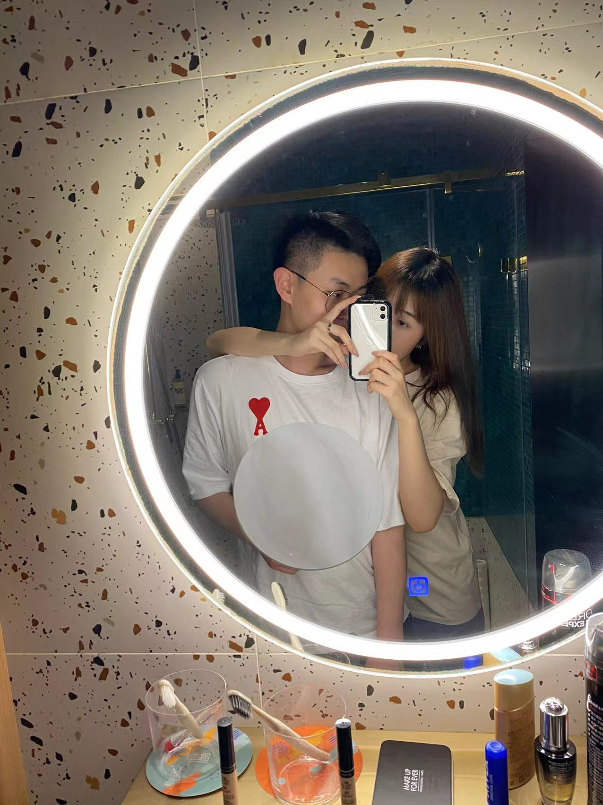
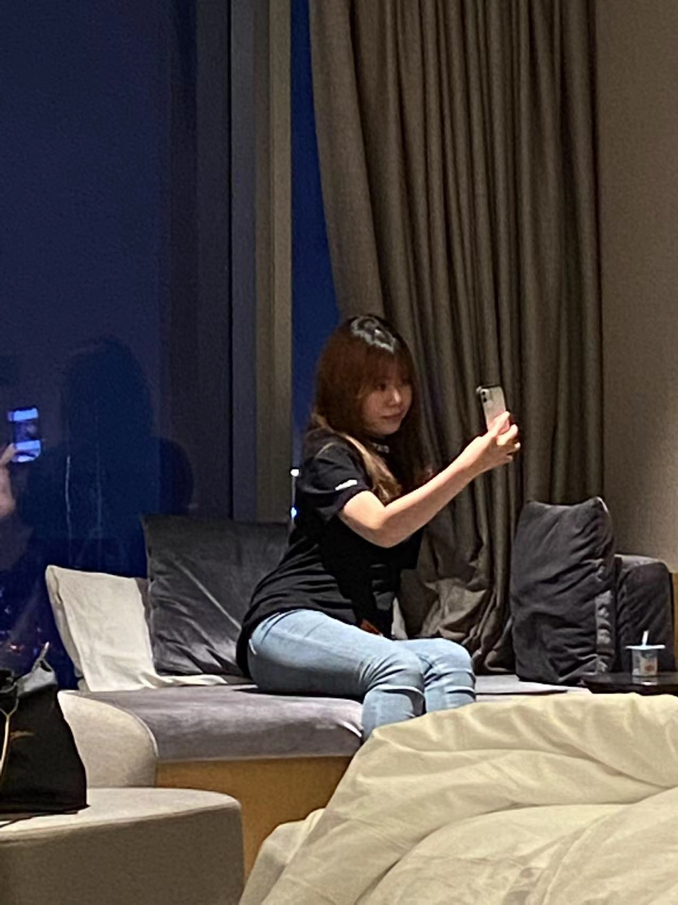

<head>
     <meta charset="UTF-8">
     <title>图片翻转</title>
     <link rel="stylesheet" href="图片翻转.css">
 </head>
 

 

  

   
<h2>还是黄毛的老婆刚跟老公从西京医院出来去吃饭饭，老婆还对老公拍的不好看很不满</h2>

  

 

 

  

   
<h2>老婆在吴先生光速把头埋起来了 那天还跟王妈吃饭了</h2>

  

 

 

  

   
<h2>老公的屏保 老婆在吴先生跟老公拍的，还要把脸脸藏在后面</h2>

  

 

 

  

   
<h2>老婆做公交车跟老公去取surprise，老婆偷偷合影</h2>

  
 
 

 

  

   
<h2>老婆在艾美做作的自拍，然后在老公的朋友圈社死！</h2>

  

  
  
 

 

 